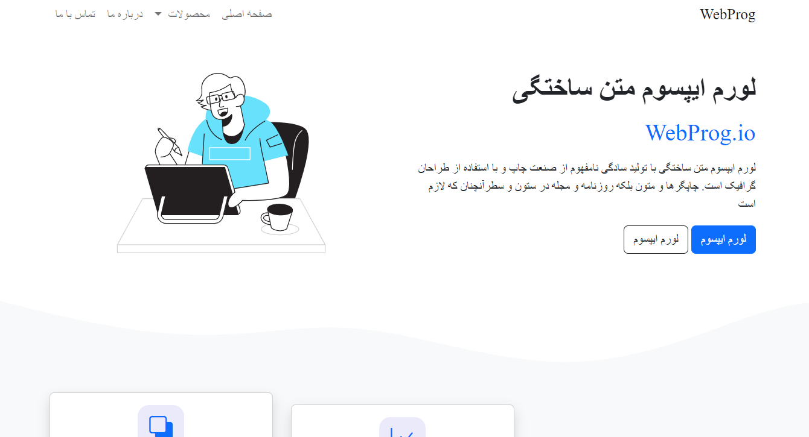
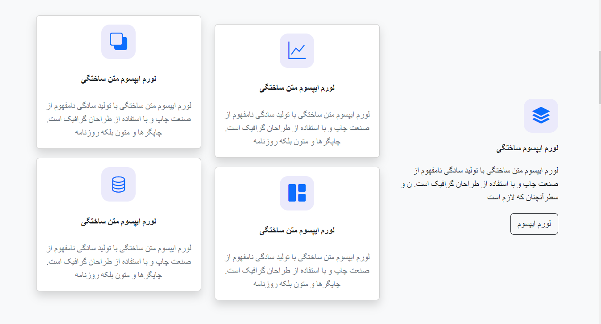
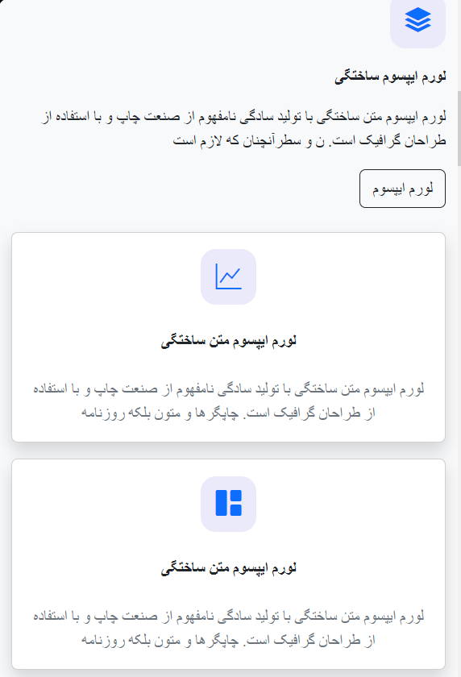

# **Bootstrap Landing Page**

#### Simple and fast fully responsive " Bootstrap landing page " that takes less than an hour to make. ⏱️

---

## Landing Page Components are :

- ### Contains responsive header with hamburger menu.
- ### 6 well designed sections responsive sections.
- ### It is rtl and and designed for rtl supported languages but it is also swapable.
- ### Package Card design with buttons.
- ### Random wavy designs to separate sections.
- ### and much more **...** 😎

---

## **The code is not that clean because, I wanted to**

## **build it A.F.A.P(as fast as possible) but website is super fast** 
## **and completely responsive so don't let my coding fool you.😊**

---

### Generally it was quick practice to test out my Bootstrap Knowledge and skills
### Please use it to imporove yours as well if not I hope it may give you ideas or inspire you.
### **I am aware of clean code issues. **This is JUST FOR learning purposes** 
### And it is "not" suitable for landing real project and this is **just a small step for getting there**.
### Thanks for checking it out make sure to give it a star. 🥰🍷

---

# Design Images for web:

---

# Design Images for Mobile:

